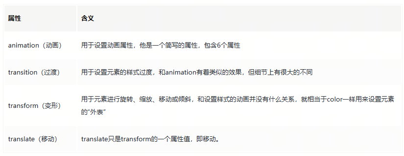
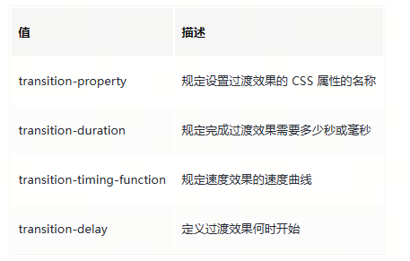
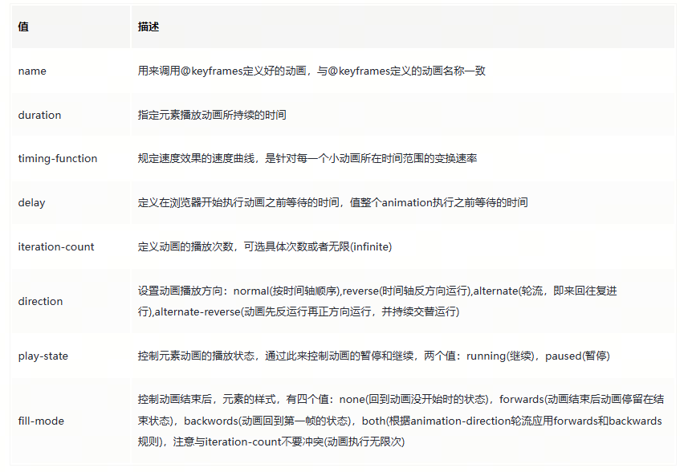

### <p align='center'>css 相关记录</p>

#### **一、CSS 关键字： initial、inherit、unset、revert**

[参考文档](https://juejin.cn/post/6987565731881680903?searchId=20231226152245E2E582F98F4EAE4646E5)

> 1. initial 将属性的初始（或默认）值应用于元素；
> 2. inherit 继承；
> 3. unset 未设置，一般搭配==all==属性使用，其更像 initial 和 inherit 的集合，对可继承元素，unset == inherit，对不可继承元素 unset == initial；
> 4. revert 恢复，与 unset 类似，对可继承元素 revert == inherit，但对不可继承元素 revert == 浏览器默认样式

```css
.div {
  background-color: red;
  color: skyblue;
  all: initial; /** 将所有属性设置为初始值 */
}

.content {
  all: unset; /** 将可继承属性设置继承值，不可继承设置为初始值 */
}
```

#### **二、CSS 动画：translate、transform、transition、animation**

[参考文档](https://juejin.cn/post/6844903615920898056?searchId=202312261522023DD164F7DE8C29461673)


> 1.transition 过渡，其有四个参数 transition-property、transition-duration、transition-timing-function、transition-delay
> 

> 2.  animation 动画，有 8 个参数 name 、duration 、timing-function、 delay 、iteration-count、 direction、 play-state、 fill-mode;
>     
> 3.  translate 平移,沿 x 轴、y 轴
>
> 4.  transform 形变，包含 rotate,scale,skew 等可以同时执行一个或多个，transform-origin 可以改变图形的原点,perspective 距离 3D 页面视口的距离

```html
<!DOCTYPE html>
<html lang="en">
  <head>
    <meta charset="UTF-8" />
    <meta name="viewport" content="width=device-width, initial-scale=1.0" />
    <title>Document</title>
  </head>
  <style>
    div {
      height: 100px;
      width: 100px;
      background-color: green;
      transform: rotate(45deg);
    }
  </style>
  <body>
    <div></div>
  </body>
</html>
```

#### **三、媒体查询**

[参考文档](https://juejin.cn/post/7021398878461100040?searchId=20231226164559F4A155E36300034FA5E0)

```css
/**屏幕大于 1024px 或小于 1440px 时应用该样式 */
@media screen and (min-width: 1024px) and (max-width: 1440px) {
  body {
  }
  div {
  }
}
/**屏幕宽度小于320px时 */
@media screen and (max-width: 320px) {
  body {
    background-color: #ffff00;
  }
}
```

#### **四、requestAnimationFrame**

[参考文档](https://juejin.cn/post/6991297852462858277?searchId=2023122616345582E63AD853D1BB2D4BE6)

> 这是一个 js 的 api,但是和动画相关，就放到这里
> 1. requestAnimationFrame需要在函数中再次调用下一帧才可以持续触发
> 2. requestAnimationFrame会向待执行函数中传入一个时间戳，执行频率为页面刷新率
> 3. requestAnimationFrame执行时会返回一个值，将这个值放cancelAnimationFrame中就可以取消这个动画帧
```js
let ref;
function test(timestamp) {
  console.log(timestamp);
  ref = requestAnimationFrame(test);
}
ref = requestAnimationFrame(test);
setTimeout(() => {
  window.cancelAnimationFrame(ref);
}, 10000);
```
