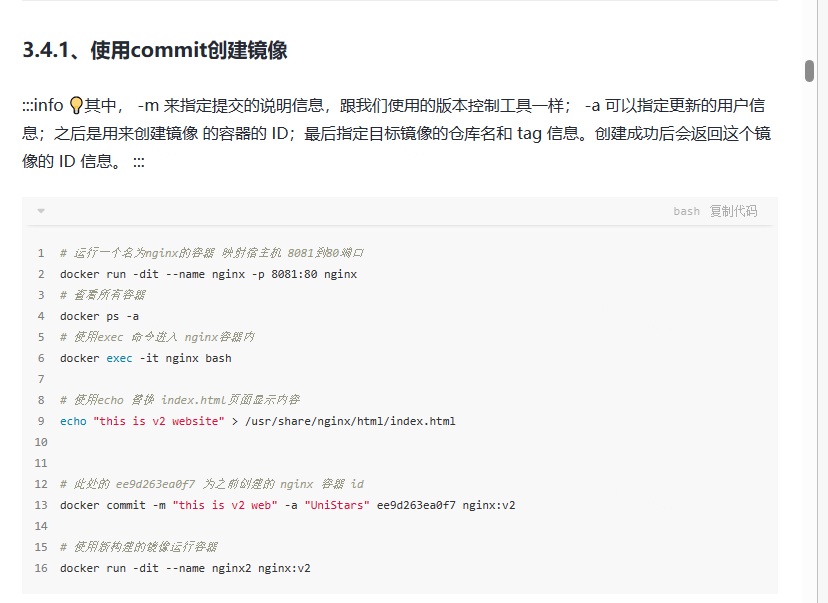
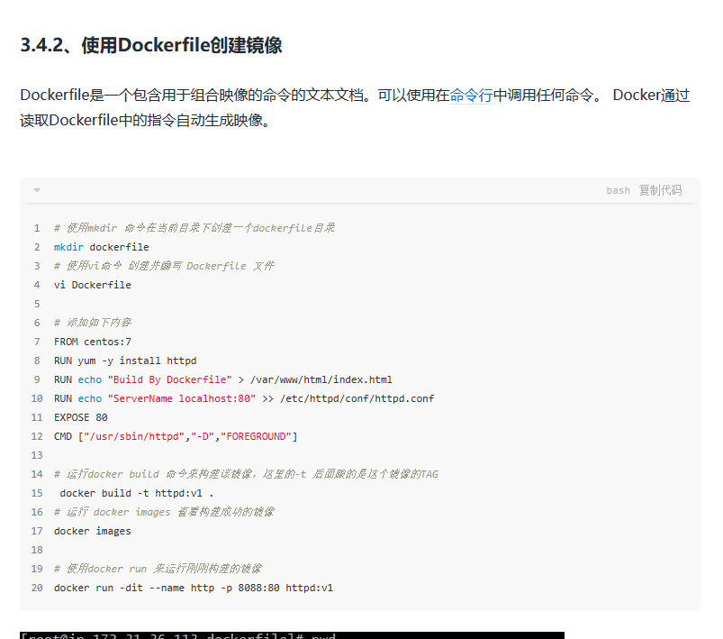
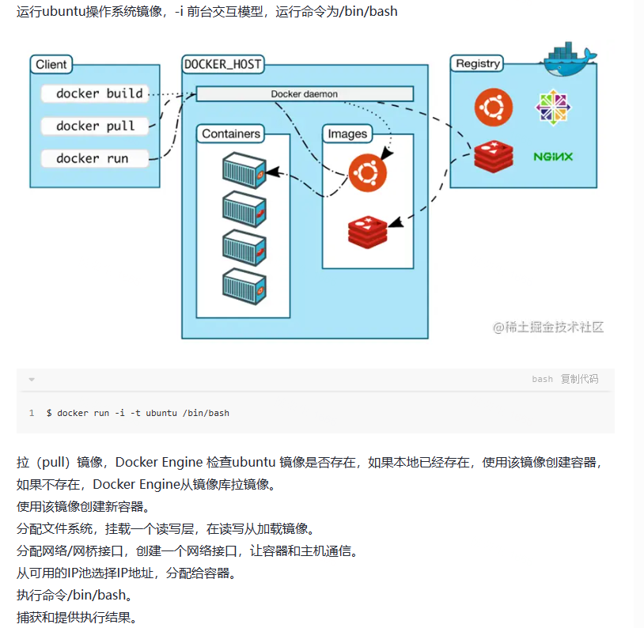
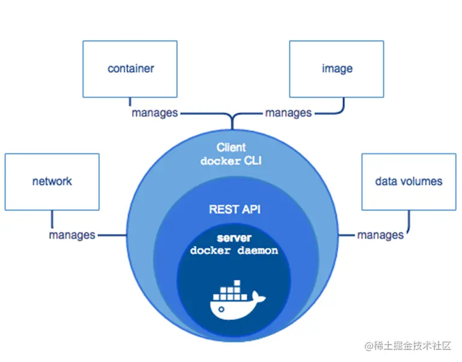
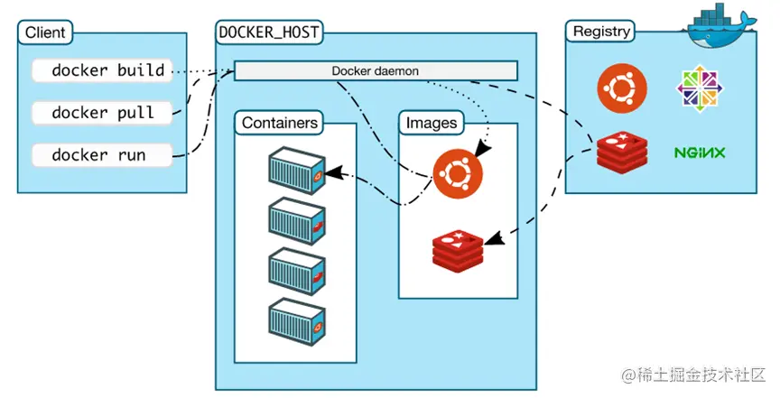

### 
 docker

[文档来源](https://juejin.cn/post/7132756861626875917?searchId=202307190939028FD93DD4F8F9FB2B8B84)
###### - docker组成
   - docker客户端
      - 命令行(CLI)交互客户端。客户端使用REST API接口同Docker daemon进行访问 
   - Docker Daemon守护进程
      - 用于管理Docker对象：镜像，容器，网络，数据卷
   - Docker image镜像
        -  一个制度模板，用于创建docker容器，由Dockerfile文本描述镜像内容
        -  拉取和列出镜像
            - docker pull images:tag
            - docekr images
        -  创建镜像
            - 使用commit创建镜像   
            -  
        -  DockerFile 文件的基本指令
            -  FROM  定义基础镜像
            - MAINTAINER 作者或维护者
            - RUN 运行linux命令
            - ADD 增加文件或目录
            - EVN 定义环境变量
            - CMD 运行进程
            - 示例(文档中有详解内容)
            
   - DockerContainer 容器
      - 是一个镜像的运行实例  
      - 运行过程
 
1.运行`$ docker run -i -t ubuntu /bin/bash`拉取镜像
2.Docker Engine检查ubuntu镜像是否存在，如果本地已经存在，使用该镜像创建容器，如果不存在，Docker Engine从镜像库拉取镜像，使用该镜像创建新容器
3.分配文件系统，挂载一个读写层，在读写层加载镜像
4.分配网络/网桥接口，创建一个网络接口，让容器和主机通信
5.从可用的IP池选择IP地址，分配给容器
6.执行命令/bin/bash   捕获和提供执行结果
  - Docker Registry仓库 

  

